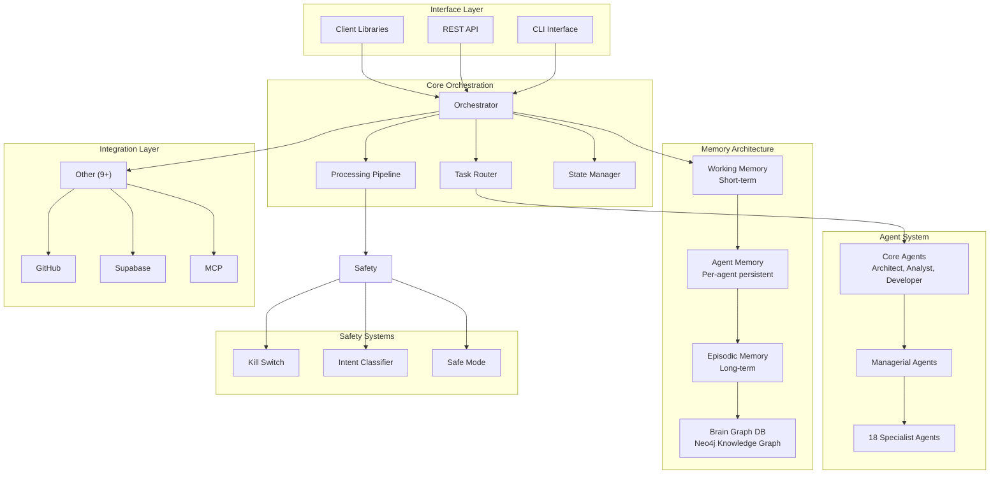
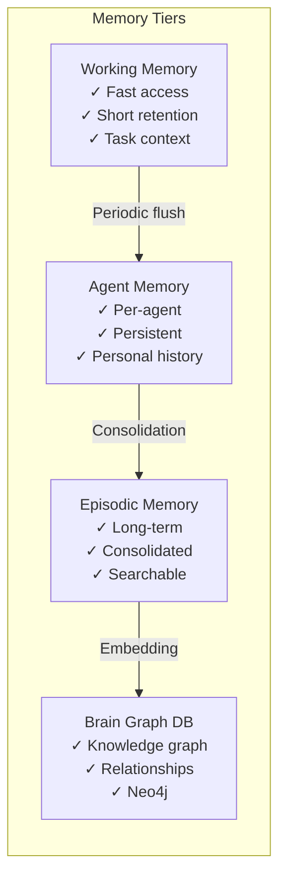
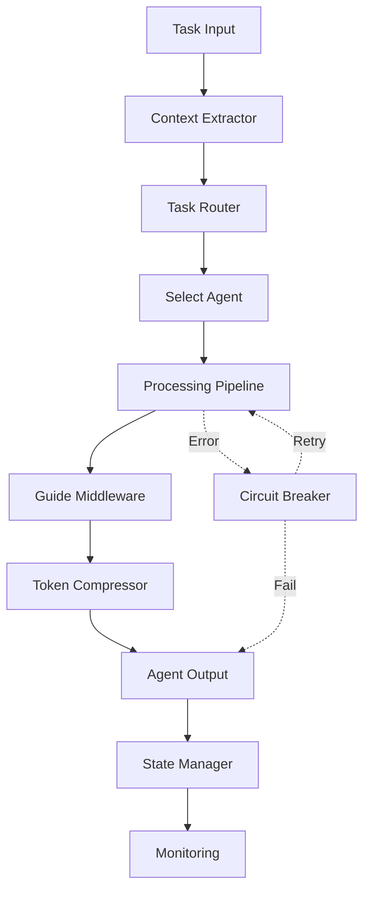
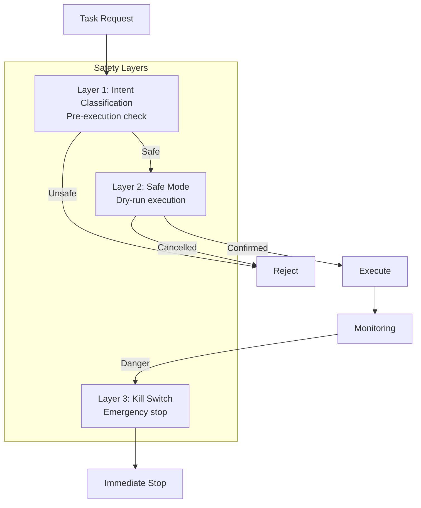
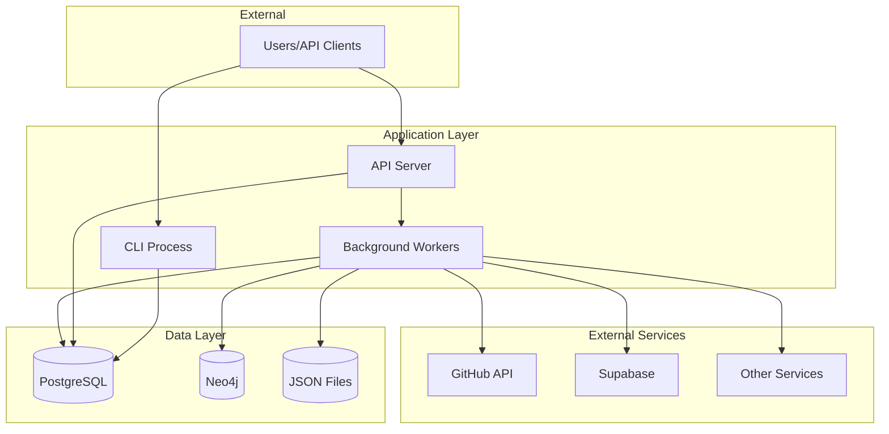

# Blackbox5 Architecture Overview

**Version:** 5.0.0
**Last Updated:** 2026-01-31
**Target Audience:** New contributors, developers, architects

---

## Executive Summary

### What is Blackbox5?

Blackbox5 is a **global AI infrastructure** for multi-agent orchestration. It provides a complete system for coordinating AI agents, managing memory, and integrating with external services.

**Core Purpose:** Enable intelligent AI agents to work collaboratively on complex tasks through hierarchical coordination, shared memory, and safety systems.

### Key Architectural Principles

1. **Hierarchical Agent System** - Agents organized in tiers (core → managerial → specialists)
2. **Multi-Tier Memory** - Working, agent, episodic, and brain graph storage
3. **Safety First** - Kill switches, constitutional AI, and safe mode built-in
4. **Plugin Architecture** - Skills, tools, and integrations are modular
5. **Orchestrated Execution** - Pipeline-based task routing and execution

### Main Components Overview

| Component | Purpose | Location |
|-----------|---------|----------|
| **Agent System** | 21 agents (3 core + 18 specialists) | `2-engine/core/agents/` |
| **Orchestration Engine** | Task routing, pipeline, state management | `2-engine/core/orchestration/` |
| **Memory Architecture** | 4-tier memory with consolidation | `2-engine/runtime/memory/` |
| **Safety Systems** | Kill switch, classifier, safe mode | `2-engine/core/safety/` |
| **Integration Layer** | 9+ external service integrations | `2-engine/tools/integrations/` |
| **Interface Layer** | CLI, REST API, client libraries | `2-engine/core/interface/` |

---

## System Architecture

### High-Level Component Diagram



### Technology Stack

| Layer | Technology |
|-------|------------|
| **Orchestration** | Python 3.10+, asyncio |
| **Agent System** | YAML definitions, Python base classes |
| **Memory** | PostgreSQL, Neo4j, JSON, SQLite |
| **API** | FastAPI |
| **CLI** | Click, Rich |
| **Safety** | Custom classification, signal handlers |
| **Integrations** | REST APIs, webhooks |

---

## Core Subsystems

### 1. Agent System

#### Hierarchical Structure

```
Core Agents (Tier 1)
├── ArchitectAgent (Alex) - System design and architecture
├── AnalystAgent (Mary) - Research and analysis
└── DeveloperAgent (Amelia) - Code implementation

Managerial Agents (Tier 2)
├── Task Lifecycle Manager
├── Memory Manager
└── Skill Manager

Specialist Agents (Tier 3)
├── Research Specialist
├── Backend Specialist
├── Frontend Specialist
├── Database Specialist
├── UI/UX Specialist
├── Performance Specialist
├── ML Specialist
├── Security Specialist
├── Testing Specialist
├── DevOps Specialist
├── API Specialist
├── Integration Specialist
├── Documentation Specialist
├── Data Specialist
├── Compliance Specialist
├── Accessibility Specialist
├── Mobile Specialist
├── Monitoring Specialist
└── ... (18 total)
```

#### Skill Loading Mechanism

Agents load capabilities from YAML skill definitions:

```yaml
# Example: backend-specialist.yaml
agent_id: specialists/backend-specialist
role: Backend Development and Server Architecture Specialist
capabilities:
  - Design RESTful APIs
  - Implement GraphQL servers
  - Build scalable microservices
  - Database optimization
skills:
  - skill:api-design
  - skill:database-optimization
  - skill:scalability-patterns
```

**Key Files:**
- Base class: `2-engine/core/agents/definitions/core/base_agent.py`
- Skill manager: `2-engine/core/agents/definitions/core/skill_manager.py`
- Agent loader: `2-engine/core/agents/definitions/core/agent_loader.py`
- Specialist YAMLs: `2-engine/core/agents/definitions/specialists/*.yaml`

---

### 2. Memory Architecture

#### Four-Tier Memory System



#### Memory Tiers

| Tier | Purpose | Storage | Retention |
|------|---------|---------|-----------|
| **Working Memory** | Active task context | In-memory | Session |
| **Agent Memory** | Per-agent persistent | PostgreSQL | Permanent |
| **Episodic Memory** | Consolidated experiences | PostgreSQL + embeddings | Permanent |
| **Brain Graph DB** | Knowledge graph | Neo4j | Permanent |

#### Consolidation Process

Memory flows from short-term to long-term through automatic consolidation:

1. **Working Memory** captures task context
2. **Periodic flush** moves important items to Agent Memory
3. **Consolidation** processes and embeds for Episodic Memory
4. **Knowledge extraction** builds relationships in Brain Graph DB

**Key Files:**
- Working: `2-engine/runtime/memory/working/`
- Agent: `2-engine/runtime/memory/agent/`
- Episodic: `2-engine/runtime/memory/episodic/`
- Brain: `2-engine/runtime/memory/brain/`
- Consolidation: `2-engine/runtime/memory/consolidation/`

---

### 3. Orchestration Engine

#### Pipeline Architecture



#### Task Routing Logic

The Task Router analyzes task requirements and routes to appropriate agents:

```python
# Simplified routing logic
def route_task(task):
    # Analyze task complexity
    complexity = analyze_complexity(task)

    # Route based on complexity
    if complexity == "simple":
        return get_specialist_agent(task.domain)
    elif complexity == "moderate":
        return get_core_agent(task.type)
    else:
        return orchestrate_multi_agent(task)
```

#### State Management

- **State Manager** - Distributed state tracking
- **Event Bus** - Event-driven communication
- **Atomic Commits** - Transaction safety
- **Circuit Breaker** - Failure isolation

**Key Files:**
- Orchestrator: `2-engine/core/orchestration/Orchestrator.py`
- Pipeline: `2-engine/core/orchestration/pipeline/`
- Router: `2-engine/core/orchestration/routing/task_router.py`
- State: `2-engine/core/orchestration/state/`
- Resilience: `2-engine/core/orchestration/resilience/`

---

### 4. Safety Systems

#### Multi-Layer Protection



#### Safety Components

| Component | Purpose | Trigger |
|-----------|---------|---------|
| **Intent Classifier** | Pre-execution content analysis | All tasks |
| **Safe Mode** | Dry-run with confirmation | Risky operations |
| **Kill Switch** | Emergency stop | Manual trigger or automatic |
| **Audit Logging** | Complete operation trail | All actions |

#### Kill Switch Mechanism

The kill switch provides instant system shutdown:

```bash
# Manual trigger
bb5 emergency-stop

# Keyboard shortcut
Ctrl+C + Ctrl+Shift+K

# Programmatic
from core.safety.kill_switch import trigger_emergency_stop
trigger_emergency_stop()
```

**Key Files:**
- Kill switch: `2-engine/core/safety/kill_switch/`
- Classifier: `2-engine/core/safety/classifier/`
- Safe mode: `2-engine/core/safety/safe_mode/`

---

### 5. Integration Layer

#### Adapter Pattern

All external integrations follow a consistent adapter pattern:

```python
class IntegrationAdapter:
    def __init__(self, credentials):
        self.client = create_client(credentials)

    def execute(self, operation, **params):
        # Pre-processing
        result = self._call_external_api(operation, params)
        # Post-processing
        return normalize_result(result)
```

#### Supported Integrations

| Integration | Purpose | Location |
|-------------|---------|----------|
| **GitHub** | Issues, PRs, repository operations | `tools/integrations/github/` |
| **Supabase** | Database, auth, storage | `tools/integrations/supabase/` |
| **MCP** | Model Context Protocol | `tools/integrations/mcp/` |
| **Notion** | Documentation sync | `tools/integrations/notion/` |
| **Vercel** | Deployment | `tools/integrations/vercel/` |
| **Cloudflare** | DNS, CDN | `tools/integrations/cloudflare/` |
| **Obsidian** | Knowledge base | `tools/integrations/obsidian/` |
| **Vibe** | Kanban board | `tools/integrations/vibe/` |

**Key Files:**
- All integrations: `2-engine/tools/integrations/`

---

## Design Patterns

### Patterns Used

| Pattern | Purpose | Location |
|---------|---------|----------|
| **Hierarchical Agents** | Tiered agent organization | `core/agents/` |
| **Plugin Architecture** | Modular skills/tools | `core/agents/definitions/specialists/` |
| **Adapter Pattern** | Integration consistency | `tools/integrations/` |
| **Dependency Injection** | Loose coupling | `core/orchestration/` |
| **Circuit Breaker** | Failure isolation | `core/orchestration/resilience/` |
| **Repository Pattern** | Data access abstraction | `runtime/memory/` |
| **Observer Pattern** | Event-driven communication | `core/orchestration/state/event_bus.py` |
| **Strategy Pattern** | Pluggable algorithms | `core/orchestration/pipeline/` |

### Anti-Patterns to Avoid

1. **Tight Coupling** - Use dependency injection instead
2. **God Objects** - Keep agents focused on single domain
3. **Shared Mutable State** - Use event bus for communication
4. **Silent Failures** - Always log errors and handle explicitly
5. **Hard-coded Credentials** - Use environment variables

---

## Data Models

### Task Data Model

```python
@dataclass
class Task:
    task_id: str
    title: str
    description: str
    priority: Priority  # P0, P1, P2, P3
    status: TaskStatus  # pending, in_progress, completed, blocked
    assigned_to: Optional[str]  # Agent ID
    dependencies: List[str]  # Task IDs
    metadata: Dict[str, Any]
    created_at: datetime
    updated_at: datetime
```

### Agent Memory Structure

```python
@dataclass
class AgentMemory:
    agent_id: str
    memory_type: MemoryType  # working, agent, episodic, brain
    content: Dict[str, Any]
    importance_score: float  # 0.0 to 1.0
    timestamp: datetime
    embeddings: Optional[np.ndarray]
    relationships: List[str]  # For brain graph DB
```

### Brain Graph Schema (Neo4j)

```
(:Concept {name, description, created_at})
(:Agent {id, type, capabilities})
(:Task {id, title, status})
(:Memory {id, content, importance})

(:Concept)-[:RELATED_TO]->(:Concept)
(:Agent)-[:EXECUTED]->(:Task)
(:Task)-[:GENERATED]->(:Concept)
(:Memory)-[:ABOUT]->(:Concept)
```

---

## Development Guide

### Quick Start for Contributors

#### 1. Setup Development Environment

```bash
# Clone repository
git clone https://github.com/LordSisodia/blackbox5.git
cd blackbox5

# Install dependencies
pip install -r requirements.txt
pip install -r requirements-dev.txt

# Setup databases (optional for development)
# PostgreSQL for agent/episodic memory
# Neo4j for brain graph DB
```

#### 2. Key Files and Their Purposes

| File | Purpose | When to Modify |
|------|---------|----------------|
| `bin/blackbox.py` | CLI entry point | Adding CLI commands |
| `2-engine/core/orchestration/Orchestrator.py` | Main orchestration | Core behavior changes |
| `2-engine/core/agents/definitions/core/base_agent.py` | Base agent class | Agent system changes |
| `2-engine/runtime/memory/` | Memory systems | Memory architecture |
| `1-docs/architecture/ARCHITECTURE-OVERVIEW.md` | This file | Architecture updates |

#### 3. Development Workflow

```bash
# 1. Create feature branch
git checkout -b feature/your-feature

# 2. Make changes
# Edit files...

# 3. Run tests
pytest tests/

# 4. Run verification
./bin/verify-task

# 5. Commit changes
git add .
git commit -m "feat: description"

# 6. Push and create PR
git push origin feature/your-feature
```

#### 4. Testing Strategy

```bash
# Unit tests
pytest tests/unit/

# Integration tests
pytest tests/integration/

# Coverage report
pytest --cov=2-engine --cov-report=html

# View report
open htmlcov/index.html
```

---

## Deployment Architecture

### Service Topology



### Resource Requirements

| Component | CPU | Memory | Storage |
|-----------|-----|--------|---------|
| **CLI/API** | 1-2 cores | 2-4 GB | 100 MB |
| **PostgreSQL** | 2-4 cores | 4-8 GB | 10-50 GB |
| **Neo4j** | 2-4 cores | 4-8 GB | 20-100 GB |
| **Workers** | 1-2 cores each | 2-4 GB each | 100 MB each |

### Security Boundaries

1. **Environment Variables** - All credentials via env vars
2. **Database Isolation** - Separate databases per project
3. **API Keys** - Rotated regularly, stored securely
4. **Network** - Internal services not exposed
5. **Audit Trail** - All actions logged

---

## References and Related Documentation

### Internal Documentation

| Document | Location | Purpose |
|----------|----------|---------|
| **SYSTEM-MAP.yaml** | Root | Machine-readable structure |
| **AGENT-GUIDE.md** | Root | AI agent quick reference |
| **CATALOG.md** | Root | Feature index (200+ features) |
| **CORE-STRUCTURE.md** | `2-engine/core/` | Core directory navigation |
| **README.md** | Root | Project overview |

### Key Decision Records

| Decision | Location | Topic |
|----------|----------|-------|
| MCP Integration | `1-docs/decisions/mcp/` | MCP architecture |
| Infrastructure | `1-docs/decisions/infrastructure/` | K8s design |
| Agent Context | `5-project-memory/blackbox5/decisions/` | Context layers |

### Implementation Guides

- `1-docs/guides/autonomous/` - Autonomous system guides
- `1-docs/engine-guides/` - Engine-specific documentation
- `1-docs/development/` - Development workflows

---

## Appendix: Common Questions

### Q: How do I add a new specialist agent?

Create a YAML file in `2-engine/core/agents/definitions/specialists/`:

```yaml
agent_id: specialists/my-specialist
role: My Specialist Description
capabilities:
  - Capability 1
  - Capability 2
skills:
  - skill:skill-name-1
  - skill:skill-name-2
```

### Q: How do I add a new integration?

Create a new directory in `2-engine/tools/integrations/` following the adapter pattern.

### Q: Where is task state stored?

In `5-project-memory/[project]/tasks/` and in PostgreSQL via the State Manager.

### Q: How do I trigger the kill switch?

```bash
bb5 emergency-stop
# or programmatically
from core.safety.kill_switch import trigger_emergency_stop
trigger_emergency_stop()
```

### Q: What's the difference between agent types?

- **Core Agents** - General-purpose (Architect, Analyst, Developer)
- **Managerial Agents** - Coordination and lifecycle management
- **Specialist Agents** - Domain-specific experts (18 specialists)

---

**Document Status:** ✅ Complete
**Maintained By:** Architecture Team
**Last Review:** 2026-01-31
**Next Review:** After major architecture changes
