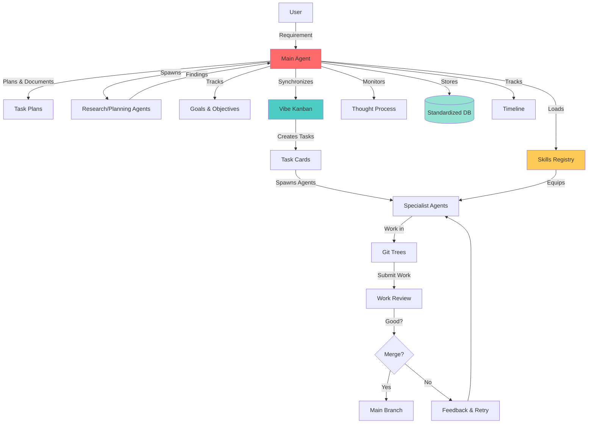

# Blackbox5 Core Flow: The Barebones Architecture

**Version:** 5.0.0
**Last Updated:** 2026-01-20
**Status:** Foundational Document
**Category:** First Principles / Core Architecture

---

## Purpose

This document defines the **barebones flow of what Blackbox5 actually is** - the fundamental architecture that makes the system work. Before testing or implementing features, we must understand this core flow.

---

## The Core Concept: A "Black Box" Autonomous Development System

**What is Blackbox5?**

Blackbox5 is an autonomous multi-agent AI orchestration system that functions as a "black box" - you provide requirements at one end, and working software comes out the other. The internal complexity is hidden; you only interact with the main agent.

**The Promise:**
- **Input:** High-level requirement ("Build a multi-tenant SaaS app")
- **Output:** Working code, deployed and tested
- **Visibility:** Full transparency into thought process, decisions, and progress

---

## The Barebones Flow (4 Stages)

### Stage 1: Talking to the Main Agent

**What happens:**
You interact with a single main agent that orchestrates everything.

**The main agent has two key capabilities:**

#### (a) Built-in Black Box Functionality
The main agent itself has black box capabilities - it can:
- Understand complex requirements
- Break down high-level goals into actionable steps
- Reason about architecture and trade-offs
- Make decisions autonomously

#### (b) System-Wide Tracking
The main agent tracks and coordinates:
- **All ongoing tasks** - What's being worked on right now
- **Goals and objectives** - What we're trying to achieve
- **Different agent groups** - Who's working on what
- **Vibe Kanban integration** - All tasks synchronized to Kanban boards

**Key Insight:** You don't talk to individual specialist agents directly. You talk to ONE main agent, and it coordinates everything else behind the scenes.

---

### Stage 2: Task Execution and Iteration

**What happens:**
The main agent plans, delegates, and verifies work through a systematic process.

#### (a) Planning and Documentation
The agent:
- **Plans out tasks** - Creates detailed task breakdowns
- **Documents everything** - Every decision, assumption, and approach is recorded
- **Creates specifications** - PRDs, epics, and technical specs are generated
- **Establishes success criteria** - How do we know when this is done?

#### (b) Research and Planning Sub-Agents
For complex work, the agent may spawn specialists:
- **Research agents** - Investigate technologies, patterns, and approaches
- **Planning agents** - Create detailed implementation plans
- **Architecture agents** - Design system structure and interactions

These sub-agents feed their findings back to the main agent for integration.

#### (c) Vibe Kanban Orchestration
The main agent uses Vibe Kanban as the execution engine:

```
┌─────────────┐
│  Main Agent │
└──────┬──────┘
       │
       │ 1. Creates tasks
       ▼
┌─────────────────┐
│  Vibe Kanban    │
│  (Task Board)   │
└────────┬────────┘
         │
         │ 2. Starts agents for each task
         ▼
┌─────────────────┐
│  Git Trees      │
│  (Isolated      │
│   Workspaces)   │
└────────┬────────┘
         │
         │ 3. Agents work in isolation
         ▼
┌─────────────────┐
│  Work Review    │
│  (Quality       │
│   Gate)         │
└────────┬────────┘
         │
         │ 4. Merge if good
         ▼
┌─────────────────┐
│  Main Branch    │
│  (Production)   │
└─────────────────┘
```

**The flow:**
1. Main agent sends tasks to Vibe Kanban
2. For each task, Vibe Kanban spawns a dedicated agent
3. Each agent works in an isolated git tree (workspace)
4. Main agent reviews the work (checks quality, tests, etc.)
5. If work is good → merge to main branch
6. If work is bad → feedback and retry

**Key Insight:** Vibe Kanban is not just a task board - it's an agent spawning system. Each task gets its own agent and workspace.

---

### Stage 3: Monitoring and Standardization

**What happens:**
Throughout the entire process, the black box ensures transparency and data consistency.

#### (a) Thought Process Visibility
Agents are required to:
- **Show their work** - Every reasoning step is logged
- **Explain decisions** - Why this approach? Why not alternatives?
- **Document trade-offs** - What was gained vs. what was lost
- **Reveal uncertainties** - What don't we know? What are we assuming?

This is not optional - it's a core requirement of the system.

#### (b) Standardized Database Storage
Everything goes into standardized databases so:
- **Different agents can use each other's work** - Agent A's output becomes Agent B's input
- **Historical analysis is possible** - We can see what worked and what didn't
- **Knowledge accumulates** - The system gets smarter over time
- **Consistency is maintained** - Same data structures, same formats

**What gets stored:**
- Task definitions and results
- Decision logs and rationale
- Code changes and reviews
- Test results and metrics
- Agent communications and handoffs

#### (c) Timeline Tracking
The black box maintains a complete timeline:
- **What was worked on** - Every task, every decision
- **When it happened** - Temporal sequence of events
- **Who worked on it** - Which agent(s) were involved
- **What was the outcome** - Success, failure, or partial completion
- **What was learned** - Insights that should inform future work

**Key Insight:** The "black box" isn't actually opaque - it's the MOST transparent system possible. You can see everything that happens inside.

---

### Stage 4: Skill Sets

**What happens:**
Agents have access to specialized capabilities that make them effective at specific tasks.

#### (a) Skills Document
There's a central registry of skills:
- **What each skill does** - Capability description
- **When to use it** - Appropriate contexts
- **How to use it** - Parameters, inputs, outputs
- **What makes it effective** - Best practices and patterns

#### (b) Agent Skill Loading
Agents are equipped with skills based on:
- **Their role** - Developer agents get coding skills, architect agents get design skills
- **The task** - Complex tasks may require specialized skills
- **Past performance** - Skills that have worked well get prioritized

#### (c) Skill as Training
Skills are essentially training:
- **They teach agents** how to perform specific tasks very well
- **They encode expertise** - Best practices, patterns, and approaches
- **They enable specialization** - Different agents can excel at different things
- **They evolve** - Skills improve based on what works

**Key Insight:** Skills are what make agents more than just general-purpose LLMs. They're specialized capabilities that make agents effective at real work.

---

## The Complete Flow Diagram



---

## Key Architectural Principles

### 1. Single Point of Contact
- **You talk to ONE agent** - the main agent
- **It coordinates everything else** - you don't manage individual specialists
- **Simplified interaction** - no need to know which agent does what

### 2. Agent Spawning per Task
- **Each task gets its own agent** - spawned by Vibe Kanban
- **Agents work in isolation** - separate git trees prevent conflicts
- **Work is reviewed before merging** - quality gate before integration

### 3. Radical Transparency
- **All thought processes are visible** - you can see how decisions were made
- **Everything is recorded** - nothing happens in a "black box"
- **Timeline is maintained** - complete history of all work

### 4. Standardized Data
- **All data uses the same schemas** - agents can share work
- **Database is the backbone** - system state lives in standardized storage
- **Knowledge accumulates** - the system learns from every task

### 5. Skill-Based Specialization
- **Agents are equipped with skills** - not just raw LLM capabilities
- **Skills are trainable** - they encode expertise and best practices
- **Right agent, right skills** - matching capabilities to tasks

---

## What This Architecture Enables

### For Users:
- **Simplified interaction** - one interface, not many
- **Visibility** - see everything that's happening
- **Confidence** - work is reviewed before merging
- **Control** - can intervene at any point

### For the System:
- **Scalability** - spawn as many agents as needed
- **Reliability** - standardized data and processes
- **Learning** - accumulation of knowledge over time
- **Quality** - review gates prevent bad code

### For Development:
- **Parallel execution** - multiple tasks at once
- **Isolation** - no conflicts between agents
- **Traceability** - full history of every change
- **Reproducibility** - can replay any decision

---

## Critical Implementation Requirements

To make this flow work, the following MUST be implemented:

### 1. Main Agent (BLOCKER - Missing)
- **Status:** Not implemented
- **Priority:** CRITICAL
- **Impact:** Cannot do end-to-end flow without this
- **Location:** Should be in `2-engine/02-agents/implementations/01-core/`

### 2. Vibe Kanban Integration (PARTIAL - Database not initialized)
- **Status:** Partially working
- **Priority:** HIGH
- **Impact:** Cannot spawn agents per task
- **Location:** `vibe-kanban/` directory
- **Blocker:** Database needs initialization

### 3. Skills Registry (BROKEN - 3 conflicting systems)
- **Status:** Multiple systems, conflicts
- **Priority:** CRITICAL
- **Impact:** Agents cannot be equipped with skills
- **Location:** `2-engine/02-agents/capabilities/`
- **Fix needed:** Consolidate to single system

### 4. Standardized Database (PARTIAL - Storage works, schema incomplete)
- **Status:** Infrastructure exists
- **Priority:** HIGH
- **Impact:** Data sharing between agents works, but schema needs standardization
- **Location:** `2-engine/03-knowledge/storage/`

### 5. Thought Process Logging (WORKING)
- **Status:** Implemented
- **Priority:** N/A
- **Impact:** Agents can and do show their work
- **Location:** `2-engine/01-core/tracking/manifest.py`

### 6. Timeline Tracking (WORKING)
- **Status:** Implemented
- **Priority:** N/A
- **Impact:** Complete history is maintained
- **Location:** `2-engine/01-core/tracking/`

---

## Testing Strategy

Before we can say Blackbox5 "works," we must test:

### Test 1: Main Agent Coordination
- **Input:** "Build a REST API with user authentication"
- **Expected:** Main agent breaks down into tasks, assigns to Kanban
- **Success Criteria:** All tasks created with proper dependencies

### Test 2: Agent Spawning
- **Input:** Task card in Vibe Kanban
- **Expected:** Specialist agent spawned, given git tree
- **Success Criteria:** Agent completes work in isolation

### Test 3: Work Review
- **Input:** Completed agent work
- **Expected:** Main agent reviews quality
- **Success Criteria:** Good work merges, bad work gets feedback

### Test 4: Data Standardization
- **Input:** Multiple agents working on related tasks
- **Expected:** Agents can use each other's outputs
- **Success Criteria:** Data flows between agents without transformation

### Test 5: Skill Application
- **Input:** Agent with specific skills
- **Expected:** Agent uses skills effectively
- **Success Criteria:** Task completed with skill-quality output

### Test 6: Timeline Tracking
- **Input:** Complete workflow execution
- **Expected:** Every event logged in sequence
- **Success Criteria:** Can reconstruct entire execution timeline

---

## Relationship to Other Architecture Documents

This document is the **foundation** for all other architecture decisions. Before reading:

- **Memory Architecture** - Understand that memory stores the data from this flow
- **Agent System** - Understand that agents are spawned by the main agent
- **Integration Points** - Understand that integrations (Vibe Kanban) enable the flow
- **Skills System** - Understand that skills equip agents for their tasks

**Read order:**
1. **This document** (BLACKBOX5-CORE-FLOW.md) ← Start here
2. Memory Architecture (ARCHITECTURE.md)
3. Agent System (VALIDATION-3-agent-system/)
4. Skills System (VALIDATION-4-skills-capabilities/)
5. Integration Architecture (6-roadmap/02-validation/VALIDATION-6-integrations-mcp/)

---

## Frequently Asked Questions

### Q: Why not talk directly to specialist agents?
**A:** Because coordinating multiple specialists is complex. The main agent handles coordination so you don't have to.

### Q: What happens if an agent fails?
**A:** The main agent detects failure, analyzes why, and either retries with different approach or escalates to you.

### Q: Can I see what agents are thinking?
**A:** Yes. All thought processes are logged and visible. You can see decisions, uncertainties, and reasoning.

### Q: How do agents share work?
**A:** Through standardized databases. Agent A's output is stored in a format Agent B can read and use.

### Q: What makes this different from just using an LLM?
**A:** Three things:
1. **Multi-agent coordination** - specialists working together
2. **Persistent memory** - learning from all work
3. **Quality gates** - review before merging

### Q: Can I intervene in the process?
**A:** Yes. You can see what's happening and provide feedback, corrections, or guidance at any point.

---

## Glossary

- **Main Agent** - The primary agent you interact with; coordinates everything
- **Specialist Agent** - Agent spawned for a specific task
- **Vibe Kanban** - Task management system that spawns agents
- **Git Tree** - Isolated workspace for an agent to work in
- **Skills** - Specialized capabilities that equip agents
- **Standardized Database** - Consistent data storage that all agents use
- **Timeline** - Complete history of all work and decisions
- **Black Box** - The system as a whole - complex inside, simple outside

---

## Document Status

**Status:** Foundational - Complete
**Next Steps:**
1. Implement Main Agent (PLAN-003)
2. Fix Skills System (PLAN-001)
3. Initialize Vibe Kanban (PLAN-005)
4. End-to-end testing

**Related Documents:**
- [EXECUTION-PLAN.md](../EXECUTION-PLAN.md) - Implementation strategy
- [CORE-COMPONENTS.md](../../CORE-COMPONENTS.md) - Component catalog
- [ARCHITECTURE.md](../../1-docs/01-theory/01-architecture/core/ARCHITECTURE.md) - System architecture

---

**Version:** 5.0.0
**Last Updated:** 2026-01-20
**Author:** Blackbox5 Core Team
**Category:** First Principles / Core Architecture
