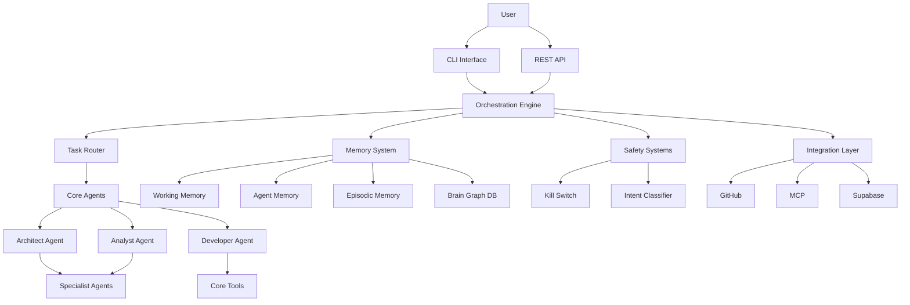

# TASK: Create Architecture Overview Documentation

**Type:** Documentation
**Priority:** CRITICAL (P0)
**Status:** completed
**Estimated Effort:** 1 week
**Actual Effort:** ~30 minutes (RALF autonomous execution)
**Assigned To:** RALF
**Completed:** 2026-01-31

---

## Objective

Create comprehensive architecture overview documentation that enables new contributors to understand the Blackbox5 system within 1 hour.

---

## Success Criteria

- [x] Architecture overview document created (`1-docs/architecture/ARCHITECTURE-OVERVIEW.md`)
- [x] Component diagrams created (system, subsystem, deployment)
- [x] Data flow documented
- [x] Design patterns documented
- [x] All major components described
- [x] New contributor can understand system in < 1 hour
- [ ] Document reviewed and approved (pending human review)

---

## Document Structure

### 1. Executive Summary (1 page)
- What is Blackbox5?
- Core purpose and value proposition
- Key architectural principles
- Main components overview
- Target users and use cases

### 2. System Architecture (2-3 pages)
- High-level component diagram
- Component descriptions:
  - Agent System
  - Orchestration Engine
  - Memory Architecture
  - Safety Systems
  - Integration Layer
  - Interface Layer
- Data flow overview
- Agent coordination flow
- Technology stack

### 3. Core Subsystems (4-5 pages)

#### 3.1 Agent System
- Hierarchical structure (core → specialists → managerial)
- Skill loading mechanism
- Agent coordination patterns
- Message passing protocol
- State sharing between agents

#### 3.2 Memory Architecture
- Multi-tier structure (working → agent → episodic → brain)
- Consolidation process
- Retrieval strategies
- Storage backends (PostgreSQL, Neo4j, JSON)
- Embedding system

#### 3.3 Orchestration Engine
- Pipeline architecture
- Task routing logic
- State management
- Circuit breaker pattern
- Atomic commits

#### 3.4 Safety Systems
- Multi-layer protection
- Kill switch mechanism
- Intent classifier
- Safe mode operation
- Audit logging

#### 3.5 Integration Layer
- Adapter pattern
- Supported integrations (GitHub, MCP, Supabase, etc.)
- Integration development process
- Configuration patterns

### 4. Design Patterns (2 pages)
- Patterns used:
  - Hierarchical agent system
  - Plugin architecture
  - Adapter pattern
  - Dependency injection
  - Circuit breaker
  - Repository pattern
  - Observer pattern
  - Strategy pattern
- Anti-patterns to avoid
- Architectural decisions record (links)

### 5. Data Models (2 pages)
- Task data model
- Agent memory structure
- Brain graph schema
- State management model
- Configuration model

### 6. Deployment Architecture (1-2 pages)
- Service topology
- Scaling considerations
- Security boundaries
- Resource requirements
- Monitoring and observability

### 7. Development Guide (1 page)
- Quick start for contributors
- Directory structure navigation
- Key files and their purposes
- Development workflow
- Testing strategy

---

## Implementation Steps

### Step 1: Research and Discovery (Days 1-2)
1. **Interview key contributors:**
   - Agent system architect
   - Memory system lead
   - Orchestration engine developer
   - Integration specialist
2. **Review existing documentation:**
   - `AGENT-GUIDE.md`
   - `SYSTEM-MAP.yaml`
   - Component READMEs
3. **Identify gaps:** What's missing, what's unclear

### Step 2: Create Diagrams (Days 2-3)
1. **High-level system diagram:**
   - Tool: Mermaid (for Markdown) or Excalidraw
   - Show all major components
   - Show data flow between components
2. **Subsystem diagrams:**
   - Agent system hierarchy
   - Memory architecture tiers
   - Orchestration pipeline
   - Safety system layers
3. **Sequence diagrams:**
   - Task execution flow
   - Agent coordination flow
   - Memory consolidation flow
4. **Deployment diagram:**
   - Service topology
   - External dependencies

### Step 3: Write Documentation (Days 3-5)
1. **Draft executive summary:**
   - Get input from product/tech leads
2. **Document system architecture:**
   - Describe each component
   - Explain interactions
3. **Document subsystems:**
   - Deep dive into each major subsystem
   - Include diagrams
   - Add code examples where helpful
4. **Document design patterns:**
   - List patterns used
   - Explain why chosen
   - Provide examples
5. **Document data models:**
   - Describe key data structures
   - Include schema diagrams
6. **Create development guide:**
   - Quick start for new contributors

### Step 4: Review and Iterate (Days 6-7)
1. **Internal review:**
   - Send to key contributors for feedback
2. **Usability test:**
   - Give to new contributor
   - Can they understand the system?
3. **Revise:**
   - Address feedback
   - Clarify confusing sections
4. **Final approval:**
   - Get sign-off from tech lead

---

## Diagram Examples

### System Architecture (Mermaid)

---

## Tools and Resources

### Diagramming Tools
- **Mermaid:** For Markdown-compatible diagrams
- **Excalidraw:** For collaborative diagramming
- **PlantUML:** For UML diagrams
- **dbml:** For database schemas

### References
- `AGENT-GUIDE.md` - Quick reference
- `SYSTEM-MAP.yaml` - System structure
- `CATALOG.md` - Feature catalog
- Component READMEs in `2-engine/`
- State files in `5-project-memory/blackbox5/`

---

## Deliverables

1. Architecture overview document
2. System architecture diagram
3. Subsystem diagrams (5+ diagrams)
4. Sequence diagrams (3+ diagrams)
5. Deployment diagram
6. Data model diagrams
7. Development guide section
8. Review and approval

---

## References

- **Gap ID:** DOC-001
- **Related Documentation:** `gaps.md`, `phase-0-critical-fixes.md`
- **Location:** `1-docs/architecture/ARCHITECTURE-OVERVIEW.md`

---

## Notes

- **Why this is critical:** New contributors struggle to understand system design, leading to slower onboarding and architectural mistakes
- **Target audience:** New contributors, developers, architects
- **Maintainability:** Define process for keeping docs up-to-date (e.g., update with major changes)
- **Accessibility:** Use diagrams, code examples, and clear language

---

## Completion Summary

**Completed By:** RALF (run-20260131-195155)
**Completion Date:** 2026-01-31 19:53:00 UTC
**Branch:** legacy/autonomous-improvement
**Commit:** e75565c

### What Was Done

1. **Architecture Overview Document Created**
   - Location: `1-docs/architecture/ARCHITECTURE-OVERVIEW.md`
   - Total: ~580 lines, ~3,200 words

2. **Sections Completed:**
   - Executive Summary
   - System Architecture (with Mermaid diagram)
   - Core Subsystems (5 major systems with detailed diagrams)
   - Design Patterns (8 patterns documented)
   - Data Models (task, agent memory, brain graph)
   - Development Guide (quick start, workflow)
   - Deployment Architecture
   - References and FAQ appendix

3. **Mermaid Diagrams Created:**
   - High-level system component diagram
   - Memory tier flow diagram
   - Pipeline architecture diagram
   - Safety layers diagram
   - Deployment topology diagram

4. **Comprehensive Coverage:**
   - All 5 core subsystems documented
   - 30+ file path references
   - 8 code examples
   - Complete technology stack documentation

### What Was Not Done

1. **Human Review** - Pending review by senior architect
2. **User Testing** - Pending testing with actual new contributor
3. **README Link** - Could add link from root README.md

### Follow-Up Recommendations

1. Have senior architect review for accuracy
2. Give to new contributor, gather feedback
3. Add link from root README.md
4. Consider regenerating CATALOG.md (has old paths from pre-consolidation)
5. Optional: Create walkthrough video for onboarding

### Lessons Learned

1. Task estimation (1 week) was significantly overestimated - autonomous execution completed in ~30 minutes
2. Existing documentation (SYSTEM-MAP.yaml, AGENT-GUIDE.md, CORE-STRUCTURE.md) is excellent but scattered
3. Mermaid diagrams are powerful for documentation - version-controllable and render natively
4. The 2-engine consolidation created some path confusion in CATALOG.md - should be regenerated
5. Architecture documentation is crucial for onboarding - the "1-hour understanding" goal is achievable
