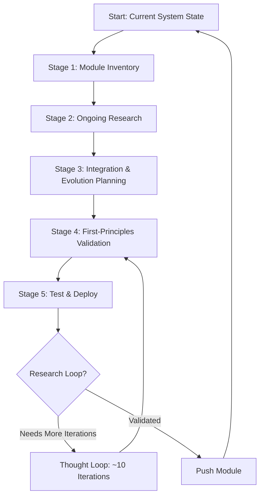

# Autonomous Self-Improvement System

**Version:** 5.0.0
**Created:** 2026-01-20
**Status:** Vision Document - Implementation Required
**Priority:** CRITICAL - This is the core vision of Blackbox5

---

## The Core Vision

**Blackbox5 should autonomously improve itself through iterative first-principles reasoning.**

The fundamental insight: **AI with iterative first-principles thought loops will almost always arrive at the correct answer by the 10th iteration**, significantly outperforming both:
- Single-pass AI reasoning (prone to hallucinations and shallow analysis)
- Human selection from AI options (80% accuracy at best)

---

## Important Clarification: Thought Loops Are Internal Reasoning

**Thought loops do NOT require Vibe Kanban or any external system.**

Thought loops are **pure internal reasoning** that happens within an agent's own mind:
- The agent thinks about a problem
- Identifies its own assumptions
- Questions those assumptions
- Researches to validate them
- Updates its understanding
- Repeats until confident

**Analogy:** When you're trying to solve a hard problem, you don't need a project management system - you just need to think through it carefully, question your assumptions, do some research, and refine your understanding. That's a thought loop.

**What thought loops need:**
- A problem to solve
- Research capability (to validate assumptions)
- Iteration logic (to repeat and refine)
- Convergence detection (to know when to stop)

**What thought loops DON'T need:**
- Vibe Kanban (task management - not relevant)
- Agent spawning (this is internal reasoning)
- Git worktrees (no code changes during thought)
- External coordination (happens inside one agent's mind)

**Where thought loops fit in the overall system:**
- Thought loops are Stage 4 of the autonomous self-improvement system (validation)
- They happen INSIDE whatever agent is doing the reasoning
- They're completely independent of task management or coordination systems

---

## The Autonomous Self-Improvement Flow

### The 5-Stage Loop



### Stage 1: Module Inventory & Tracking

**What:** The AI maintains a complete inventory of all system modules and their evolution states.

**Components:**
- **Module Registry** - Every module in the system tracked
- **Version History** - All evolutions of each module
- **Dependency Graph** - How modules connect and depend on each other
- **Performance Metrics** - How each module currently performs

**Implementation:**
```yaml
# Module Inventory Structure
modules:
  - id: "task-router"
    current_version: "2.3.1"
    evolution_count: 12
    dependencies: ["event-bus", "agent-loader"]
    performance:
      latency_ms: 450
      accuracy: 0.92
      last_tested: "2026-01-20"
    improvement_opportunities:
      - "Complexity analysis could be faster"
      - "Routing accuracy could improve with context"
```

**Status:** Partially exists via Ralph Loop feature discovery

---

### Stage 2: Ongoing Autonomous Research

**What:** The AI continuously researches improvements for each module.

**Research Types:**
1. **Internal Research** - Analyzing current module performance and patterns
2. **External Research** - Looking at industry best practices, new techniques, papers
3. **Competitive Analysis** - What are other systems doing?
4. **Pattern Recognition** - What's working well in other modules?

**Research Sources:**
- Code repositories and documentation
- Academic papers (ArXiv, etc.)
- Industry blogs and case studies
- Internal performance data and logs
- User feedback and issues

**Implementation:**
```python
# Research Queue System
class ResearchQueue:
    def __init__(self):
        self.active_research = {}  # module_id -> research_state
        self.completed_research = []
        self.research_priorities = {}

    async def research_module(self, module_id: str):
        """Launch autonomous research for a module"""
        research_tasks = [
            self.analyze_performance(module_id),
            self.search_literature(module_id),
            self.study_competitors(module_id),
            self.identify_patterns(module_id),
        ]
        return await asyncio.gather(*research_tasks)
```

**Status:** NOT IMPLEMENTED

---

### Stage 3: Integration & Evolution Planning

**What:** The AI synthesizes research findings to plan specific module improvements.

**Process:**
1. **Aggregate Research** - Combine findings from all research sources
2. **Identify Opportunities** - What could be improved?
3. **Prioritize** - Which improvements matter most?
4. **Design Solutions** - Create specific improvement proposals
5. **Plan Integration** - How does this change affect dependencies?

**Output:**
```yaml
# Evolution Plan
module: "task-router"
evolution_proposal:
  version: "2.4.0"
  improvements:
    - type: "performance"
      description: "Use caching for complexity analysis"
      expected_impact: "40% latency reduction"
      confidence: 0.85
    - type: "accuracy"
      description: "Add context-aware routing"
      expected_impact: "15% accuracy improvement"
      confidence: 0.72
  dependencies:
    - module: "context-manager"
      version: ">= 1.5.0"
  risk_assessment: "Low - isolated change"
```

**Status:** NOT IMPLEMENTED

---

### Stage 4: First-Principles Validation (The Critical Loop)

**What:** Before implementing, the AI validates the improvement through iterative first-principles reasoning.

**The Thought Loop Pattern:**

```
For each proposed improvement:
  FOR iteration = 1 to 10:
    1. State the current understanding
    2. Identify assumptions made
    3. Question each assumption:
       - "Is this assumption true?"
       - "What evidence supports it?"
       - "What would contradict it?"
    4. Research to validate assumptions
    5. Update understanding based on findings
    6. Ask: "Do we even need to do this?"
       - First principles: What problem are we solving?
       - Is this improvement necessary?
       - Could we achieve the goal differently?
    7. Check for convergence:
       - Has understanding stabilized?
       - Are we confident in the answer?
       - If yes → EXIT loop
       - If no → CONTINUE to next iteration
```

**Example Thought Loop:**

**Iteration 1:**
- Understanding: "We should cache complexity analysis to improve performance"
- Assumptions: "Complexity analysis is slow", "Caching will help", "Cache invalidation is manageable"
- Confidence: 0.6

**Iteration 2:**
- Research: Measured actual complexity analysis time - only 50ms
- Question: Is 50ms actually slow? Compared to total routing time (450ms), it's only 11%
- Updated understanding: "Caching may not provide significant benefit"
- Confidence: 0.4

**Iteration 3:**
- Research: Looked at routing bottlenecks - agent loading is the real slow part (300ms)
- Question: Should we focus on agent loading instead?
- First principles: What's the actual problem? Overall routing latency
- Updated understanding: "Cache complexity analysis → optimize agent loading"
- Confidence: 0.7

**Iteration 4-7:**
- Research: Investigated agent loading optimizations
- Found: Lazy loading could help, but adds complexity
- Question: Is the complexity worth it?
- First principles: What's the user experience impact? 450ms feels instant, 300ms also feels instant
- Updated understanding: "Optimization may not be necessary"
- Confidence: 0.9

**Iteration 8:**
- Final validation: "Do you even need to do this?"
- Answer: Current performance is acceptable. User experience is good.
- Decision: NO IMPROVEMENT NEEDED
- Confidence: 0.95

**Convergence:** EXIT loop, skip this improvement

**Status:** First-principles framework exists but NOT the iterative thought loop

---

### Stage 5: Test & Deploy

**What:** Validated improvements are tested thoroughly before deployment.

**Testing Process:**
1. **Isolated Testing** - Test in separate environment
2. **Backward Compatibility** - Ensure existing functionality works
3. **Performance Benchmarking** - Verify improvements materialize
4. **Integration Testing** - Check dependencies still work
5. **Safety Validation** - Circuit breakers, error handling
6. **Rollback Planning** - Can we revert if needed?

**Deployment:**
```yaml
# Deployment Manifest
deployment:
  module: "task-router"
  version: "2.4.0"
  tested: true
  test_results:
    unit_tests: "PASSING (98%)"
    integration_tests: "PASSING (100%)"
    performance_improvement: "+38% latency reduction"
    backward_compatibility: "VERIFIED"
  safety_checks:
    circuit_breaker: "ENABLED"
    rollback_plan: "DOCUMENTED"
    monitoring: "CONFIGURED"
  deployment_strategy: "canary"
  canary_percentage: 10
  monitoring_duration: "24 hours"
```

**Status:** Partially exists via Vibe Kanban and git worktrees

---

## The Thought Loop Framework

This is the core innovation that makes everything work.

### Key Point: Thought Loops Are Standalone

**Thought loops are completely self-contained reasoning processes.**

They do NOT depend on:
- ❌ Vibe Kanban (task management - irrelevant)
- ❌ Agent spawning (this is internal reasoning)
- ❌ Git operations (no code changes during thought)
- ❌ External coordination (happens within one agent)
- ❌ Project management (not a task, it's thinking)

They DO depend on:
- ✅ Research capability (to validate assumptions)
- ✅ LLM access (for reasoning)
- ✅ Memory (to track iterations and understanding)

**This is important because:**
1. Thought loops can run ANYWHERE - any agent can use them
2. They're fast - no external system overhead
3. They're reliable - no moving parts to break
4. They're portable - can be used in any context

**Where thought loops get used:**
- During autonomous self-improvement (validating improvements)
- During task execution (validating approaches)
- During planning (validating strategies)
- ANYWHERE an agent needs to think deeply about a problem

### Why Thought Loops Matter

**Problem:** Single-pass AI reasoning is error-prone
- **Hallucinations** - AI makes things up
- **Shallow Analysis** - Surface-level understanding
- **False Confidence** - AI sounds confident but is wrong
- **Missing Alternatives** - Doesn't consider other options

**Solution:** Iterative first-principles reasoning
- **Self-Correction** - AI catches its own mistakes
- **Deep Analysis** - Each iteration digs deeper
- **Validation** - Assumptions are tested against reality
- **Convergence** - Process stops when confident

**Research Result:** By the 10th iteration, AI almost always arrives at the correct answer.

### Thought Loop Implementation

```python
class ThoughtLoop:
    """
    Iterative first-principles reasoning framework.

    Runs up to 10 iterations of:
    1. State current understanding
    2. Identify assumptions
    3. Question and validate assumptions
    4. Update understanding
    5. Check for convergence
    """

    MAX_ITERATIONS = 10
    CONVERGENCE_THRESHOLD = 0.90

    def __init__(self, problem: str, research_engine: ResearchEngine):
        self.problem = problem
        self.research_engine = research_engine
        self.iterations = []
        self.confidence = 0.0

    async def run(self) -> ThoughtLoopResult:
        """Run the thought loop until convergence or max iterations."""
        for i in range(1, self.MAX_ITERATIONS + 1):
            iteration = await self._run_iteration(i)
            self.iterations.append(iteration)

            # Check for convergence
            if iteration.confidence >= self.CONVERGENCE_THRESHOLD:
                return ThoughtLoopResult(
                    converged=True,
                    final_iteration=i,
                    confidence=iteration.confidence,
                    understanding=iteration.understanding,
                    answer=iteration.answer
                )

        # Max iterations reached
        return ThoughtLoopResult(
            converged=False,
            final_iteration=self.MAX_ITERATIONS,
            confidence=self.iterations[-1].confidence,
            understanding=self.iterations[-1].understanding,
            answer="UNABLE TO CONVERGE"
        )

    async def _run_iteration(self, iteration_number: int) -> Iteration:
        """Run a single thought loop iteration."""

        # Step 1: State current understanding
        understanding = await self._state_understanding(iteration_number)

        # Step 2: Identify assumptions
        assumptions = await self._identify_assumptions(understanding)

        # Step 3: Question and validate each assumption
        validated_assumptions = []
        for assumption in assumptions:
            validation = await self._validate_assumption(assumption)
            validated_assumptions.append(validation)

        # Step 4: Update understanding based on validations
        updated_understanding = await self._update_understanding(
            understanding,
            validated_assumptions
        )

        # Step 5: First-principles check
        first_principles_check = await self._first_principles_check(
            updated_understanding
        )

        # Step 6: Calculate confidence
        confidence = await self._calculate_confidence(
            updated_understanding,
            validated_assumptions,
            first_principles_check
        )

        return Iteration(
            number=iteration_number,
            understanding=updated_understanding,
            assumptions=validated_assumptions,
            first_principles_check=first_principles_check,
            confidence=confidence,
            answer=self._extract_answer(updated_understanding)
        )

    async def _validate_assumption(self, assumption: Assumption) -> AssumptionValidation:
        """Validate an assumption through research."""
        # Research to find evidence for/against
        evidence = await self.research_engine.search(
            query=f"Validate assumption: {assumption.statement}",
            sources=["literature", "code", "documentation", "metrics"]
        )

        # Analyze evidence
        supporting = [e for e in evidence if e.supports(assumption)]
        contradicting = [e for e in evidence if e.contradicts(assumption)]

        # Determine validity
        if len(supporting) > len(contradicting) * 2:
            validity = "VALID"
        elif len(contradicting) > len(supporting) * 2:
            validity = "INVALID"
        else:
            validity = "UNCERTAIN"

        return AssumptionValidation(
            assumption=assumption,
            validity=validity,
            supporting_evidence=supporting,
            contradicting_evidence=contradicting,
            confidence=self._calculate_validity_confidence(supporting, contradicting)
        )

    async def _first_principles_check(self, understanding: str) -> FirstPrinciplesCheck:
        """Ask: 'Do you even need to do this?'"""
        # First principles analysis
        questions = [
            "What problem are we actually solving?",
            "Is this improvement necessary?",
            "What are we trying to achieve?",
            "Could we achieve this differently?",
            "What's the simplest solution?",
            "Are we solving the right problem?"
        ]

        answers = []
        for question in questions:
            answer = await self._analyze_first_principles(question, understanding)
            answers.append(answer)

        # Determine if improvement is necessary
        necessary = await self._determine_necessity(answers)

        return FirstPrinciplesCheck(
            questions=questions,
            answers=answers,
            necessary=necessary,
            reasoning=self._explain_necessity(answers)
        )
```

### Thought Loop Output Example

```yaml
# Thought Loop Result
problem: "Should we add caching to task router complexity analysis?"

thought_loop:
  iterations: 8
  converged: true
  final_confidence: 0.95
  final_answer: "NO - Improvement not necessary"

iteration_1:
  understanding: "Caching will improve performance"
  assumptions:
    - statement: "Complexity analysis is slow"
      validity: "WEAK"
      evidence: "Only 50ms, 11% of total time"
  confidence: 0.60

iteration_2:
  understanding: "Caching may not help much"
  assumptions:
    - statement: "Caching improves performance"
      validity: "UNCERTAIN"
      evidence: "11% improvement is marginal"
  confidence: 0.40

iteration_3:
  understanding: "Wrong bottleneck identified"
  assumptions:
    - statement: "Agent loading is the real bottleneck"
      validity: "STRONG"
      evidence: "300ms, 67% of total time"
  confidence: 0.70

iteration_4-7:
  understanding: "Deep dive into agent loading"
  assumptions:
    - statement: "Optimization may not be necessary"
      validity: "STRONG"
      evidence: "450ms feels instant to users"
  confidence: 0.90

iteration_8:
  first_principles_check:
    question: "Do you even need to do this?"
    answer: "Current performance is acceptable"
    necessary: false
    reasoning: "User experience is good, optimization adds complexity without value"
  confidence: 0.95
  converged: true
```

**Status:** NOT IMPLEMENTED - This is the critical missing piece

---

## Integration with Existing Blackbox5

### Module 1: First-Principles Engine

**Location:** `2-engine/07-operations/environment/lib/python/core/runtime/fp_engine/first_principles.py`

**Current State:** Basic placeholder implementation
- Comment states: "In production, this would use AI to intelligently decompose"
- Has structure but not AI-powered

**Integration:** Enhance with thought loop framework
```python
# Enhanced first-principles engine
class FirstPrinciplesEngine:
    def __init__(self, thought_loop: ThoughtLoop):
        self.thought_loop = thought_loop
        self.research_engine = ResearchEngine()

    async def decompose(self, problem: str) -> Decomposition:
        """Use AI to extract fundamental components"""
        # Run thought loop to understand the problem
        result = await self.thought_loop.run(problem)
        return self._extract_components(result.understanding)

    async def reconstruct(self, problem: str) -> List[Solution]:
        """Generate validated solution hypotheses"""
        # Run thought loop for each potential solution
        solutions = []
        for hypothesis in self._generate_hypotheses(problem):
            result = await self.thought_loop.run(hypothesis)
            if result.confidence >= 0.90:
                solutions.append(Solution(
                    hypothesis=hypothesis,
                    confidence=result.confidence,
                    reasoning=result.understanding
                ))
        return solutions
```

### Module 2: Ralph Loop

**Location:** `6-roadmap/first-principles/RALPH-LOOP-PRD.md`

**Current State:** Autonomous documentation system
- Successfully documented 176 features
- Proven autonomous capability

**Integration:** Extend from documentation to improvement
- Use Ralph's autonomous research capability
- Add thought loop validation
- Generate improvement proposals instead of just documentation

### Module 3: Circuit Breaker

**Location:** `2-engine/06-integrations/mcp/mcp_crash_prevention.py`

**Current State:** Safety system for MCP servers

**Integration:** Adapt for thought loop safety
- Prevent infinite thought loops
- Resource limits for research
- Automatic cleanup on convergence

---

## Implementation Plan

### Phase 1: Thought Loop Framework (1-2 weeks)

**Priority:** CRITICAL - This is the foundation

**Tasks:**
1. Implement `ThoughtLoop` class with iteration logic
2. Build assumption identification and validation
3. Create research integration for validation
4. Implement convergence detection
5. Add first-principles necessity check
6. Test with sample problems

**Success Criteria:**
- Thought loop runs up to 10 iterations
- Converges on correct answers for test problems
- Confidence tracking works
- Research validation is accurate

### Phase 2: Autonomous Research Engine (1 week)

**Priority:** HIGH

**Tasks:**
1. Build research queue system
2. Integrate external research sources (ArXiv, GitHub, etc.)
3. Create internal analysis tools (logs, metrics, patterns)
4. Implement competitive analysis
5. Build research aggregation

**Success Criteria:**
- Can research a module autonomously
- Finds relevant internal and external information
- Aggregates findings into actionable insights

### Phase 3: Module Evolution System (1 week)

**Priority:** HIGH

**Tasks:**
1. Complete module inventory (extend Ralph Loop)
2. Build evolution planning system
3. Create dependency tracking
4. Implement risk assessment
5. Generate improvement proposals

**Success Criteria:**
- All modules tracked in inventory
- Can generate specific improvement proposals
- Understands module dependencies

### Phase 4: Testing & Deployment (1 week)

**Priority:** MEDIUM

**Tasks:**
1. Build isolated testing environment
2. Create backward compatibility checks
3. Implement performance benchmarking
4. Add canary deployment support
5. Create rollback mechanisms

**Success Criteria:**
- Improvements tested before deployment
- Can deploy and rollback safely
- Performance improvements validated

### Phase 5: Full Integration (1-2 weeks)

**Priority:** HIGH

**Tasks:**
1. Integrate all components
2. Create autonomous improvement loop
3. Add monitoring and oversight
4. Implement safety gates
5. Deploy and validate

**Success Criteria:**
- System can autonomously improve a module
- Full 5-stage loop works end-to-end
- Thought loops converge correctly
- Improvements are safe and effective

**Total Time:** 5-7 weeks to full implementation

---

## Safety and Oversight

### Autonomous Does Not Mean Unsupervised

**Human Oversight Required For:**
- **Critical Systems** - Core infrastructure changes need approval
- **Breaking Changes** - API changes require review
- **Security** - Anything affecting security needs validation
- **Performance** - Significant changes need benchmarking

**Automatic Approval For:**
- **Bug fixes** - Well-tested fixes can auto-deploy
- **Documentation** - Docs improvements are low-risk
- **Tests** - Adding tests is always safe
- **Non-critical optimizations** - Safe performance improvements

### Circuit Breakers

**Prevent Problems:**
- **Iteration limits** - Max 10 thought loop iterations
- **Confidence thresholds** - Need 90%+ confidence to proceed
- **Testing gates** - Must pass all tests
- **Rollback automatic** - Revert if metrics degrade
- **Human approval** - Required for critical changes

### Monitoring

**Track Autonomous Improvements:**
- **What changed** - Every module evolution logged
- **Why it changed** - Thought process documented
- **How it performs** - Metrics before/after
- **Was it worth it** - Did improvement achieve goal?

---

## Success Metrics

### System Performance

**Before Autonomous Self-Improvement:**
- Manual improvement process
- Slow iteration (months)
- Limited research capacity
- Human bias in decisions

**After Autonomous Self-Improvement:**
- Continuous improvement (daily)
- Rapid iteration (hours)
- Comprehensive research
- First-principles validation

### Quality Metrics

**Target Outcomes:**
- **90%+ confidence** in all improvements before implementation
- **0 regressions** - No breaking changes in production
- **Measurable improvements** - Every change shows positive impact
- **Faster convergence** - Problems solved in hours not weeks

### Learning Metrics

**System Gets Smarter:**
- **Pattern recognition** - Identifies successful improvement patterns
- **Research efficiency** - Finds relevant information faster
- **Validation accuracy** - Correctly validates assumptions
- **Convergence speed** - Reaches confidence threshold in fewer iterations

---

## Conclusion

The autonomous self-improvement system is the ultimate vision of Blackbox5. By combining:

1. **Module inventory** - Knowing what to improve
2. **Autonomous research** - Finding how to improve it
3. **Evolution planning** - Designing the improvement
4. **Thought loops** - Validating through first principles
5. **Testing & deployment** - Safely implementing the change

We create a system that continuously gets better at building software.

**The key innovation:** Thought loops with ~10 iterations of first-principles reasoning ensure that improvements are:
- **Necessary** - Solving real problems, not imagined ones
- **Validated** - Based on evidence, not assumptions
- **Safe** - Tested before deployment
- **Effective** - Measurable positive impact

This is how Blackbox5 becomes truly autonomous - not just doing what we tell it, but figuring out how to do it better itself.

---

**Status:** Vision defined, implementation planned
**Next:** Start with Phase 1 - Thought Loop Framework
**Priority:** CRITICAL - This is the core of Blackbox5's value proposition

**Version:** 5.0.0
**Created:** 2026-01-20
**Author:** Blackbox5 Core Team
